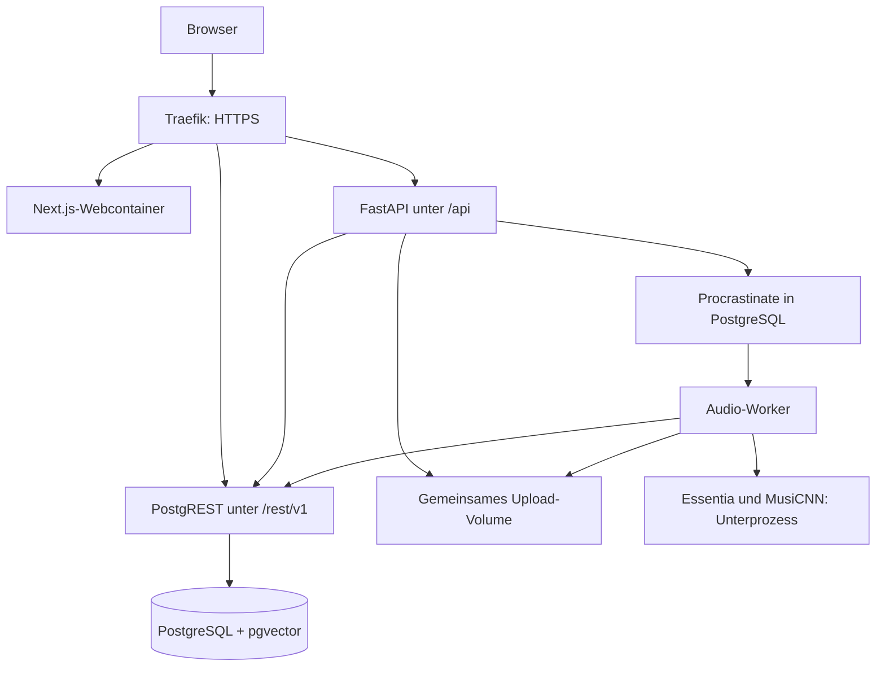

# Architektur

Stand: 2026-09-15 · Codebasis: GitHub main `f5ea2fa`. Gemessene Produktion separat im [Statusbericht](status-2026-09-15.md).

## Komponenten und Datenfluss

PostgREST übersetzt REST-Abfragen in Datenbankzugriffe. Der Supabase-Client wird dafür weiterverwendet; seine Namen bedeuten nicht, dass Produktion Supabase Cloud benötigt. Procrastinate verbindet sich direkt mit PostgreSQL.

## Code-Einstiegspunkte

| Pfad | Verantwortung |
|---|---|
| [apps/web/app/page.tsx](../apps/web/app/page.tsx) | Startseite |
| [AnalyzeView.tsx](../apps/web/app/components/AnalyzeView.tsx) | Phasen der Benutzeroberfläche |
| [useAnalyzeState.ts](../apps/web/app/hooks/useAnalyzeState.ts) | Upload-, Such- und Ergebniszustand |
| [api.ts](../apps/web/lib/api.ts) | HTTP, Wiederholungen, Timeouts und SSE |
| [main.py](../apps/api/app/main.py) | API-Lebenszyklus, Middleware und Routen |
| [similar.py](../apps/api/app/routes/similar.py) | Ranking, Blend und Vibe |
| [jobs.py](../apps/api/app/services/jobs.py) | Persistenter Analysefortschritt und Bereinigung |
| [workers](../apps/api/app/workers) | Queue-Aufgaben und Merkmalsextraktion |
| [migrations](../supabase/migrations) | Tabellen, Rechte, Indizes und SQL-Funktionen |

## Drei Eingangswege

1. **Bestehender Song:** Textsuche bzw. Metadatenzuordnung → gespeicherte Vektoren → Ranking.
2. **Plattform-URL:** Plattform-Metadaten lesen → Katalogmatch. Bei Miss kann Deezer-Ingest im Hintergrund starten; URL-Identifikation ist daher nicht allgemein schreibfrei. Unterstützte Dienste: YouTube, SoundCloud, Spotify, Apple Music, Deezer.
3. **Audiodatei:** MIME-/Größenprüfung, ffprobe-Dauerprüfung → Upload-Volume → Queue → isolierte Extraktion → Normalisierung/Metadaten → Speicherung und Ergebnisse. Fortschritt über SSE, Ersatzweg per Ergebnisabfrage.

API und Worker teilen Jobstatus über analysis_jobs, nicht über Prozessspeicher. Uploadlimit: 50 MiB, Dauerlimit: 15 Minuten. SSE maximal 900 Sekunden; processing ohne Statusupdate seit 300 Sekunden wird bei Abfrage als gescheitert gemeldet. Das ist nicht automatisch eine persistente Statusänderung oder eine Garantie über den Zustand des Workers.

## Klangmerkmale und Ranking

| Signal | Dimensionen | Rolle |
|---|---:|---|
| MusiCNN | 200 | Kandidatensuche über HNSW |
| MERT-v1-95M | 768 | Ergänzende Nachsortierung, wenn vorhanden |
| Handcrafted | 44 | Fokus und erklärbare Klangmerkmale |

44 Merkmale: MFCC-Mittelwerte 0–12, MFCC-Streuung 13–25, HPCP 26–37, spektraler Schwerpunkt 38, Rolloff 39, BPM 40, Zero-Crossing-Rate 41, Lautheit 42, Danceability 43. Normalisierung erfolgt per Z-Score aus config.

Einzelsuche: HNSW-Kandidaten → ausgeschlossene IDs entfernen → Signale kombinieren → Versionen deduplizieren → Diversität mit MMR (lambda 0,7) → begrenzen. Standardgewichtung mit MERT 65/15/20, ohne MERT 80/20; Fokus und Genre-Gewichte können abweichen. Diese Beschreibung ist Sollverhalten des Codes, kein Nachweis, dass jede Live-Abfrage es nutzt: [bekannter Fehler](../KNOWN_ERRORS.md).

Blend sucht um den Mittelpunkt zweier Embeddings. Vibe kombiniert Nachbarschaften von 2–5 Seeds mit Mittelpunkt-Fallback. Die drei Suchmodi besitzen nicht durchgehend dieselbe Fusion. Scores sind keine kalibrierten Gefallenswahrscheinlichkeiten.

## Datenhaltung

- songs: Metadaten, Herkunft, BPM/Tonart, raw/norm-Handcrafted sowie MusiCNN/MERT.
- config: Normalisierungsstatistiken; Änderungen daran beeinflussen den gesamten Vergleichsraum.
- analysis_jobs: Fortschritt, Ergebnis, Fehler und Dateizuordnung.
- Procrastinate-Tabellen: Ausführung und Wiederholung der Aufgaben.
- feedback/click_events: Bewertungen und Ereignisse; abgeleitete Views für Gewichtung/Reporting.
- Browser-localStorage: Playlist und Verlauf; sessionStorage: Sitzungs- und A/B-Zuordnung. Keine Kontosynchronisierung.

SQL-Migrationen enthalten historische Supabase-Annahmen. Live-Schema und effektive Rechte müssen vor Neuaufbau oder Migration verglichen werden. Migration 005 beschreibt den Queue-Bootstrap nur; Procrastinate erzeugt sein Schema über die CLI.

## Grenzen und technische Risiken

- Fehlende Normalisierung, Vektor-Parsing und Radar-Skalierung: R2/R3.
- Asynchrone Routen verwenden teilweise synchrone Datenbankaufrufe; skalierende Last nicht allein aus Endpoint-Timings ableiten.
- Fehler können als reduzierte Funktion zurückgegeben werden; HTTP 200 allein beweist keine Fusion oder erfolgreiche Songpersistenz.
- Worker und Datenbank teilen einen Host mit weiteren Projekten; CPU-/Speichergrenzen und Dateibereinigung sind relevant.
- MERT importiert torch/transformers separat; diese stehen nicht als vollständige MERT-Laufzeit in der regulären API-Abhängigkeitsliste. Modellcode wird über trust_remote_code geladen; einen eigenständigen, überprüften Modellstand planen.
- Keine aktuelle Hörqualitätsabnahme oder komplette E2E-Suite im Repository belegt.
